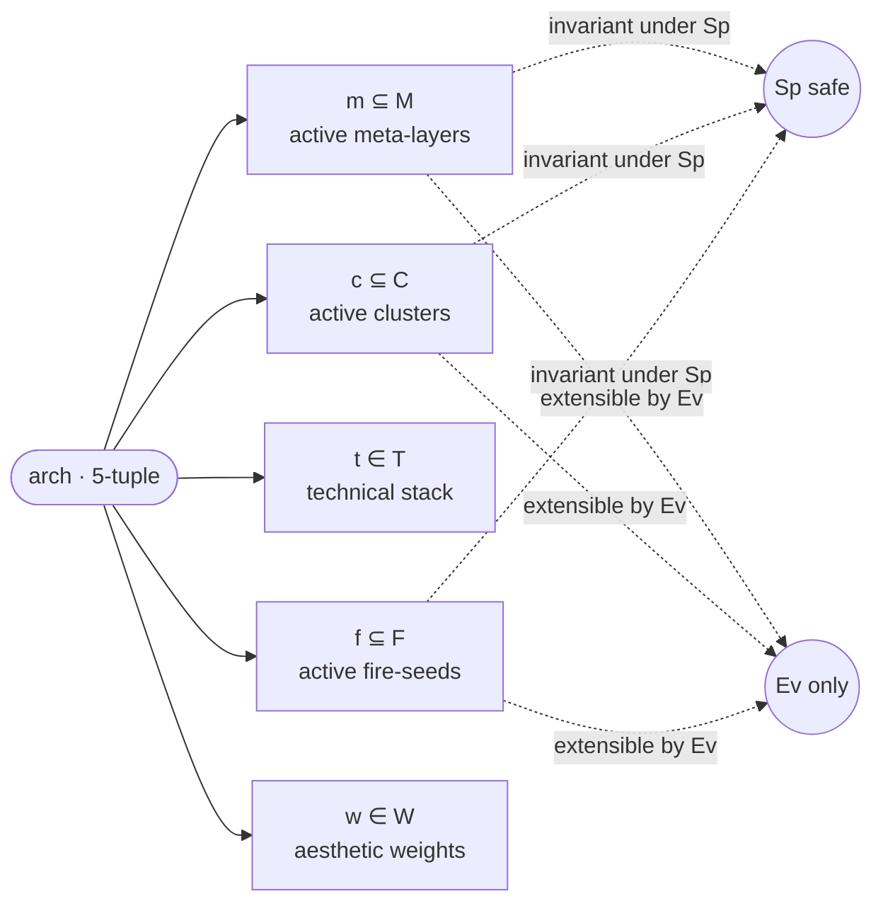
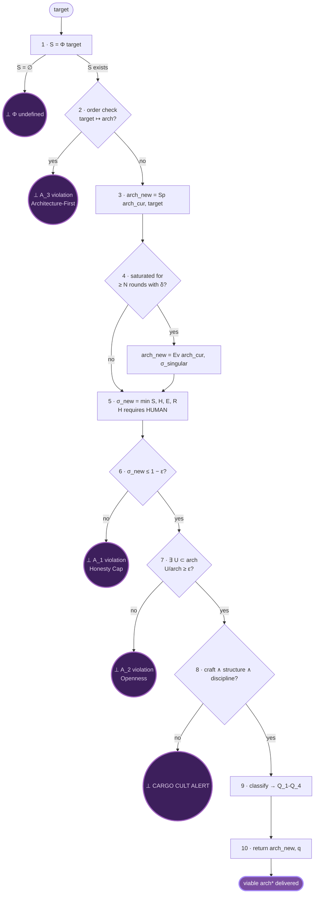
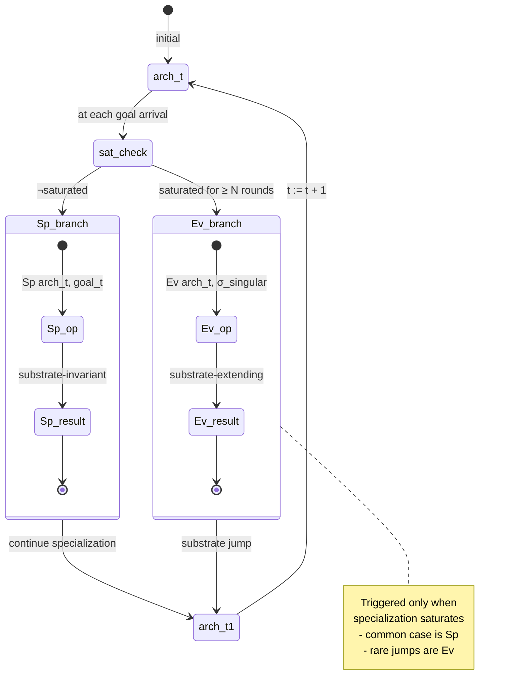
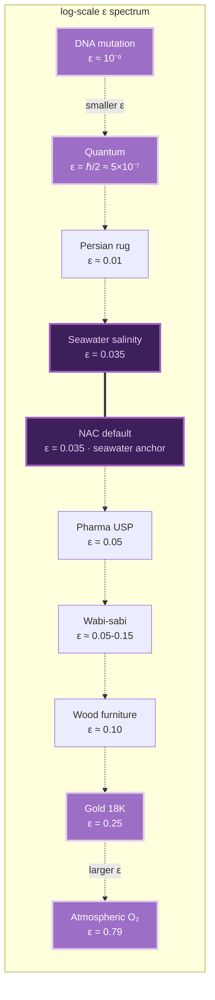
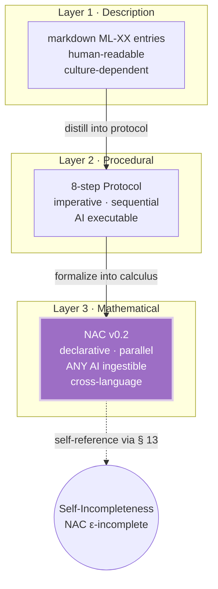
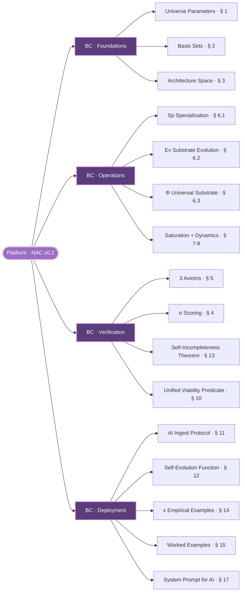
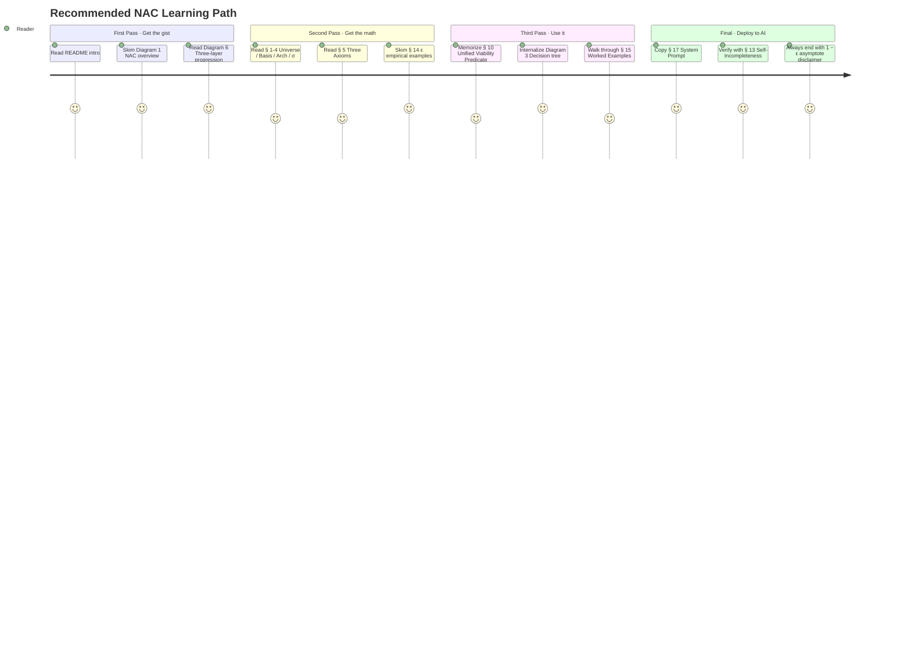

# NAC Visualizations · Hierarchical Knowledge Map

> Built using the **architect-vision toolkit** logic — visual-first, hierarchical, AI-ingestible diagrams.
> All diagrams use Mermaid (GitHub-native rendering · no external dependencies).

---

## 1 · NAC Architecture Map (Top-Level)

The 5 structural pillars of NAC and how they relate.

```mermaid
graph TB
    NAC([NAC v0.2<br/>Universal Form])

    NAC --> BASIS[Basis Sets · § 2]
    NAC --> SCORE[σ Scoring · § 4]
    NAC --> AXIOMS[3 Axioms · § 5]
    NAC --> OPS[3 Operations · § 6]
    NAC --> CLASSIFY[Classification · § 9<br/>Q_1 / Q_2 / Q_3 / Q_4]

    BASIS --> M[M : meta-layers · 5-set]
    BASIS --> C[C : clusters · 5-set]
    BASIS --> A[A : 4 axes]
    BASIS --> F[F : fire-seeds · n-set]
    BASIS --> W[W : aesthetic weights · Σ=1]
    BASIS --> AB[∂ : foundations<br/>HUMAN-RESERVED · not delegable]
    BASIS --> G[G : governance scope]

    AXIOMS --> A1[A_1 Honesty Cap<br/>σ arch ≤ 1 − ε]
    AXIOMS --> A2[A_2 Openness Subspace<br/>∃ U ⊂ arch ·  U/arch ≥ ε  ∧  U ⊥ G]
    AXIOMS --> A3[A_3 Architecture-First<br/>order arch ↦ target]

    OPS --> SP[Sp · Specialization<br/>substrate-invariant]
    OPS --> EV[Ev · Substrate Evolution<br/>set-extending · trigger saturated]
    OPS --> PHI[Φ · Universal Substrate<br/>iso physical/digital/abstract/chemical]

    SCORE --> S[S · Structural resilience]
    SCORE --> H[H · Cognitive Honesty<br/>HUMAN ONLY · AI cannot self-evaluate]
    SCORE --> E[E · Evolutionary plasticity]
    SCORE --> R[R · Relevance]

    classDef reserved fill:#5a3d7a,stroke:#cc88dd,stroke-width:2px,color:#ffffff
    class AB,H reserved
```



**Key insight**: Pink nodes (`∂`, `H`) are **human-reserved** by axiom. Any AI ingesting NAC must yield to a human judge for these — this is the heart of the framework's safety property.

---

## 2 · Architecture Tuple Structure (arch ∈ Arch)

Every architecture is a 5-tuple. This is what an AI Agent reads / writes / evolves.



`Sp` (specialization) keeps `M, C, F` unchanged — only weights and active subsets vary.
`Ev` (substrate evolution) is the **only** operation that can extend these basis sets — and only when `saturated`.

---

## 3 · AI Ingest Decision Tree (10-Step Protocol)

Any AI Agent, on receiving a target, follows this decision tree. Each red `⊥` is an axiom violation that aborts the path.



---

## 4 · Evolution Dynamics (Time-Stepped)

The `Sp / Ev` switch controls how architecture moves through `Arch` space over time.



---

## 5 · ε Empirical Examples (Cross-Domain)

`ε` is a universe parameter, not a magic number. Each domain selects its own `ε` via natural / engineering pressure.



**Verified domains** (blue): empirically measured by NOAA / NASA / USGS / physics community / etc.

**Conclusion**: `ε > 0` is universal. 100% purity = death (burn / break / dissolve / extinct). Every viable system has its own `ε`.

---

## 6 · Three-Layer Engineering Progression

How NDB-Architect-Agent disciplines map onto progressively-richer engineering forms.



Each layer serves a different audience.
- **Layer 1** for humans documenting tacit knowledge.
- **Layer 2** for AI Agents executing decision flows.
- **Layer 3** for **any** AI Agent ingesting + evolving the framework — this is what NAC delivers.

---

## 7 · Self-Incompleteness Theorem (Meta-Recursive)

NAC applies its own openness axiom to itself.

```mermaid
graph TB
    NAC_v([NAC_v · any version])
    NAC_v -->|NAC is itself an arch ∈ Arch| Self_arch[NAC_v ∈ Arch]
    Self_arch -->|apply A_2 to NAC_v| Open[∃ U ⊂ NAC_v<br/>|U|/|NAC_v| ≥ ε<br/>U ⊥ G_NAC]
    Open --> Truth[T = U is unmodeled truth]
    Truth -->|T ⊄ NAC_v| Theorem[Theorem · § 13<br/>NAC always 1 − ε asymptote<br/>ε-incomplete forever]

    Theorem -.->|next release| NAC_v_next([NAC_v+1])
    NAC_v_next -.-|same theorem still holds| Theorem

    classDef axiom fill:#5a3d7a,stroke:#cc88dd,stroke-width:2px,color:#ffffff
    class Open axiom
    classDef self fill:#3d1f5c,stroke:#a060c0,stroke-width:3px,color:#dfceea
    class Theorem self
```

**This is NAC's analogue of Gödel's Second Incompleteness Theorem applied to architecture.**
Any framework claiming to be 100% complete violates A_1. Any framework that doesn't acknowledge its own ε-incomplete subspace violates A_2.
NAC explicitly accepts both. The version number stays at `v0.x` permanently.

---

## 8 · Hierarchical Knowledge Map (Platform → BC → Board)

Mapping NAC into the **architect-vision toolkit** structure (Platform = NAC framework, BC = bounded contexts, Board = leaf concepts).



---

## 9 · Reading Order for Newcomers



---

## Why these visuals matter

The **architect-vision toolkit** principle is *Architecture-as-Truth* — diagrams are the canonical version of the system, not text descriptions.

For NAC specifically:
- Diagram 1 lets any AI immediately see the **shape** of the framework before parsing math.
- Diagram 3 turns the 10-step protocol into a runnable mental flowchart.
- Diagram 5 anchors `ε` empirically across 10 domains so no reader doubts whether `ε > 0` is real.
- Diagram 7 makes the meta-recursive Self-Incompleteness Theorem **visually obvious** — and impossible to ignore when claiming completeness.

Every diagram is GitHub-native (Mermaid) — no rendering tools, no images, no LFS. Just text in a `.md` file.

---

```
(1 − ε) asymptote · ε always reserved
```
